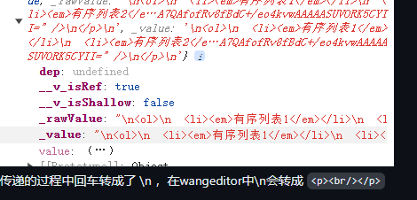

# 描述
项目需求，让docx转html，并在编辑器中展示，这个是使用了mammoth进行了转换，使用wangeditor进行展示

问题：使用python_mammoth转的html，也就是项目中```content```值，在https://www.wangeditor.com/demo/set-html.html 中可以展示，但是在项目中效果差强人意

页面阐述：
复现问题：这个页面是将wangeditor编辑器封装成了一个组件，在父页面模拟请求获取数据再通过props传递编辑区双向绑定的```valueHtml```值

正常效果：将wangeditor编辑器和获取html放在了同一个页面使用，```valueHtml```模拟请求获取数据后直接使用，可以正常显示

```已经成功解决啦！```在此感谢作者大大

在传递时，回车解析成了换行，所以在传递时```.replace(/\n/, '')```，可以完美解决

